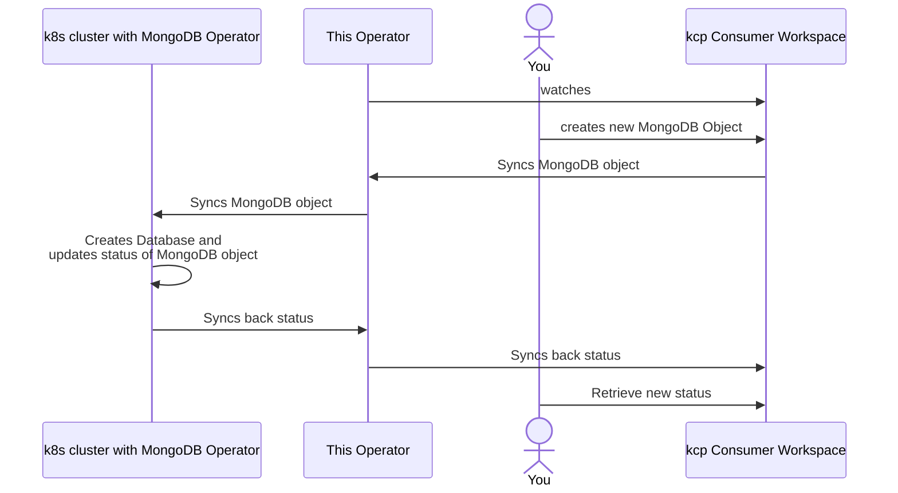
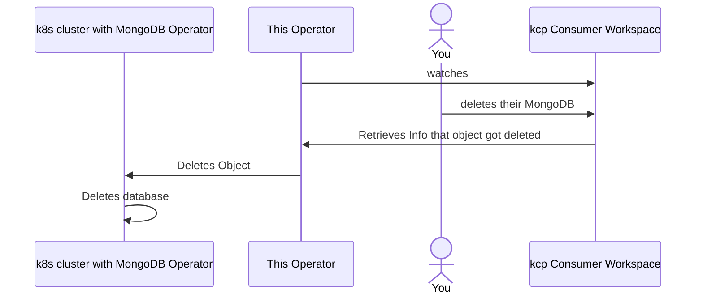

# Multiclusterruntime Example for MongoDB

This example shows how to build a syncher which syncs objects from kcp workspaces into a separate Kubernetes cluster and afterwards syncs any status updates from the downstream object back into kcp. It includes a demo based on the MongoDB Community Operator.

It is a barebone example to show that you can build a custom syncher if [api-syncagent](https://github.com/kcp-dev/api-syncagent) is not sufficient for your use-cases. It should be noted that this example does not handle any object collisions or related resources. It is far from production ready!

Here is a high-level workflow for creation:



Here is a high-level workflow for deletion:



## How to use this example

1. Create a kind cluster and install the MongoDB Operator

    ```sh
    export KUBECONFIG=cluster.kubeconfig
    kind create cluster --name mongodb
    helm repo add mongodb https://mongodb.github.io/helm-charts
    helm repo update
    helm upgrade mongodb mongodb/community-operator --version 0.13.0 --install --namespace mongodb --create-namespace
    kubectl apply -f sample/mongo-secret.yaml
    ```

2. Start kcp locally

    ```sh
    kcp start --bind-address=127.0.0.1
    ```

3. Create the consumer and mongodb workspace

    ```sh
    export KUBECONFIG=".kcp/admin.kubeconfig"
    kubectl create workspace consumer
    kubectl create workspace mongodb
    ```

4. Create the ResourceSchema, APIExport, APIBinding & MongoDB namespace

    ```sh
    kubectl ws :root:mongodb
    kubectl apply -f sample/mongo-api.yaml
    kubectl ws :root:consumer
    kubectl apply -f sample/apibinding.yaml
    kubectl create namespace mongodb
    ```

5. Create the kcp kubeconfig for our controller

    ```sh
    kubectl ws :root:mongodb
    kubectl config view --minify --flatten > kcp.kubeconfig
    # set the server to the VirtualWorkspace url
    kubectl --kubeconfig=kcp.kubeconfig config set-cluster "workspace.kcp.io/current" --server $(kubectl get apiexportendpointslices.apis.kcp.io mongodb -o jsonpath='{.status.endpoints[0].url}')
    ```

6. Start the controller

    ```sh
    go run main.go --kcp-kubeconfig=kcp.kubeconfig --target-kubeconfig=cluster.kubeconfig
    ```

7. Create a MongoDB in the consumer workspace

    ```sh
    export KUBECONFIG=".kcp/admin.kubeconfig"
    kubectl ws :root:consumer
    kubectl apply -f sample/mongodb.yaml
    ```

    The syncer will sync the mongodb from kcp into the kubernetes cluster. After around a minute you should see in your Kubernetes cluster that the PHASE and VERSION field of your cluster are filled. The syncer will then sync this status into kcp. In the end, you should see the following in your kcp consumer workspace:

    ```sh
    $ export KUBECONFIG=.kcp/admin.kubeconfig
    $ k ws :root:consumer
    $ k -n mongodb get mongodbcommunity.mongodbcommunity.mongodb.com example-mongodb
    NAME              PHASE     VERSION
    example-mongodb   Running   6.0.5
    ```

8. Delete the object again

    ```sh
    export KUBECONFIG=".kcp/admin.kubeconfig"
    kubectl ws :root:consumer
    kubectl delete -f sample/mongodb.yaml
    ```

    You should now see that the object disappears both in kcp as well as in the downstream cluster.

## Support, Feedback, Contributing

This project is open to feature requests/suggestions, bug reports etc. via [GitHub issues](https://github.com/platform-mesh/example-mongodb-multiclusterruntime/issues). Contribution and feedback are encouraged and always welcome. For more information about how to contribute, the project structure, as well as additional contribution information, see our [Contribution Guidelines](CONTRIBUTING.md).

## Security / Disclosure

If you find any bug that may be a security problem, please follow our instructions at [in our security policy](https://github.com/platform-mesh/example-mongodb-multiclusterruntime/security/policy) on how to report it. Please do not create GitHub issues for security-related doubts or problems.

## Code of Conduct

Please refer to our [Code of Conduct](https://github.com/platform-mesh/.github/blob/main/CODE_OF_CONDUCT.md) for information on the expected conduct for contributing to Platform Mesh.

<p align="center"></p>
